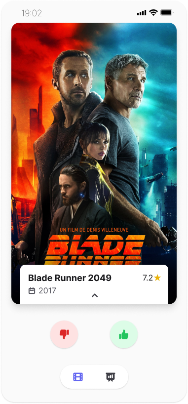
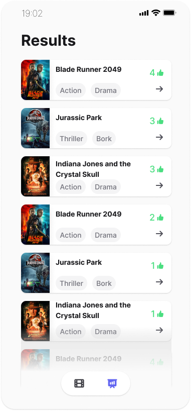

<div align="center">

# Demov Frontend


[](https://www.figma.com/file/Jz8Zi0DbDhMoh5IeIV2K9R/Demov-UI?type=design&node-id=7520%3A482&mode=design&t=8qv6Pxz1skv4NZgp-1)

_Demov is a simple application that lets you and your friends quickly decide what movie to watch. Hop into a party, pick your genre, and get swiping!_

This repository contains the *frontend* component of the application. For the backend component, see [here](https://github.com/cgund98/demov).



</div>

## Getting Started

The application runs entirely on AWS, using serverless lambda functions for compute and DynamoDB as the datastore.

It is built and deployed using the CDK.

### Pre-requisites
* Install Node.js verson 14.X

### Installation

*Note: It is required that you have already deployed the backend component of demov.*

1. Install NPM dependencies
```bash
npm install
```

2. Configure AWS environment
```bash
export AWS_ACCESS_KEY_ID=...
export AWS_SECRET_ACCES_KEY=...
```

3. (_Optional_) Start development server:
```bash
npm start
```


4. (_Optional_) Configure deployment environment.  Defaults to `dev`
```bash
export DEPLOYMENT=nonprod
```

5. Build and launch application
```bash
npx cdk synth
npx cdk deploy
```

### Useful commands

* `npm build:tailwind`: Builds the index.css file with the Tailwind CLI.
* `npm start`: Starts the local development server. 
* `npm build`: Builds production JS files. 
* `npm lint`: Lints the codebase with ESLint.
* `npm prettier-format`: Formats the codebase with Prettier.

## Project Structure
```
demov
├── .github -- GitHub Actions workflows
├── bin     -- CDK Entrypoint
├── docs
├── lib     -- CDK Service Stack
├── public  -- Static files
└── src
    ├── api         -- Request/response API definitions
    ├── components  -- Additional react components
    ├── pages       -- Individual page react components
    ├── pwa         -- Progressive web app configuration
    ├── state       -- Redux state definitions
    └── utils       -- Additional uitilities
```